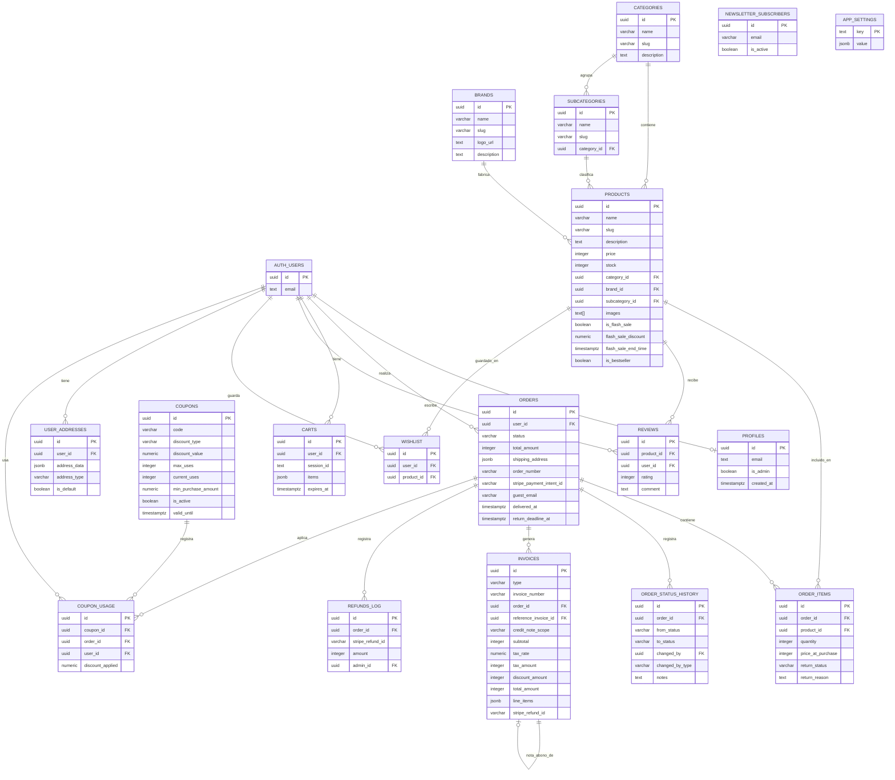

# ÉCLAT Beauty — Documentación Técnica del Proyecto

**Asignatura:** Desarrollo de Comercio Electrónico  
**Proyecto:** Tienda online de cosmética premium  
**Stack:** Astro 5 · Supabase · Stripe · Brevo · Cloudinary · Coolify

---

## 1. Justificación del Stack Tecnológico

### Framework principal: **Astro 5**

Astro es un framework moderno orientado a contenido que permite combinar **SSG (Static Site Generation)** y **SSR (Server-Side Rendering)** en el mismo proyecto. Esta dualidad se conoce como modo híbrido y es ideal para e-commerce porque:

| Tipo de página | Estrategia | Justificación |
|---|---|---|
| FAQ, Contacto, Sobre nosotros, Envíos | **SSG** (`prerender = true`) | Contenido fijo → se genera 1 vez en build, máxima velocidad y SEO |
| Catálogo, Productos, Categorías | **SSR** | Datos dinámicos: stock, precios, flash sales → deben ser frescos en cada petición |
| Carrito, Checkout, Mi Cuenta | **SSR** | Requieren sesión autenticada y datos en tiempo real |
| API routes, Panel Admin | **SSR** | Lógica de negocio, escrituras en BD, acceso exclusivo para admins |

Astro minimiza el JavaScript enviado al cliente gracias a su arquitectura de **islas** (islands architecture): sólo los componentes interactivos (carrito, búsqueda, filtros) cargan JavaScript. El resto se sirve como HTML estático.

### Componentes de React: **React 18**

Los componentes interactivos (islas) se construyen con React. Esto permite usar el ecosistema React completo (hooks, contexto, bibliotecas de terceros) exclusivamente donde se necesita interactividad, sin penalizar la carga general de la página.

Componentes islas principales:
- `CheckoutFlow.tsx` — proceso de pago multi-paso
- `AdminOrderActions.tsx` — gestión de pedidos en admin
- `CountdownTimer.tsx` — temporizador de flash sales
- `ProductFilters.tsx` — filtros del catálogo

### Estado global: **Nanostores**

Nanostores se eligió frente a Redux o Zustand porque:
- Es **framework-agnostic**: funciona igual en Astro, React y Vanilla JS
- Muy **ligero** (~1KB vs 8KB+ de Redux)
- Soporta **`@nanostores/persistent`** para persistir el carrito en localStorage automáticamente
- Compatible con la arquitectura de islas de Astro

Stores implementados:
- `cart.ts` — carrito persistente con sincronización a Supabase (registrado/invitado)
- `notifications.ts` — sistema de notificaciones toast

### Base de datos: **Supabase (PostgreSQL)**

Supabase proporciona:
- **PostgreSQL** completo con soporte a JSONB, arrays, constraints y triggers
- **Row Level Security (RLS)** para proteger datos a nivel de base de datos
- **RPCs (Remote Procedure Calls)** con `SECURITY DEFINER` para operaciones atómicas sin exponer `service_role`
- **Auth** integrada con JWT y refresh tokens
- **Realtime** (disponible si se requiere en futuras fases)
- **SDK TypeScript** de primera clase

La alternativa (Firebase) fue descartada por ser NoSQL, lo que dificultaría consultas relacionales complejas como el reporte del dashboard o los cálculos de facturación.

### Pagos: **Stripe**

Stripe es el estándar del sector para pagos online. Se integra mediante:
- **Checkout Sessions**: Stripe gestiona el formulario de pago (PCI-DSS compliant, sin datos de tarjeta en nuestros servidores)
- **Webhooks**: el evento `checkout.session.completed` confirma el pago y desencadena la creación de la orden, reducción de stock y generación de factura
- **Refunds API**: devoluciones totales y parciales a través de la API con validación automática del importe cobrado real

### Email transaccional: **Brevo (Sendinblue)**

Brevo se usa para el envío de emails transaccionales:
- Confirmación de pedido (con factura PDF adjunta)
- Notificación de envío
- Notificación de cancelación
- Nota de abono en devoluciones

Se eligió sobre SendGrid por su generoso plan gratuito (300 emails/día) y su API sencilla con soporte a adjuntos binarios (PDF como Buffer).

### Almacenamiento de imágenes: **Cloudinary**

Cloudinary gestiona las imágenes de productos con:
- **Transformaciones on-the-fly**: redimensionado, WebP, compresión
- **CDN global**: entrega rápida desde servidores próximos al usuario
- **Upload firmado**: el admin sube imágenes directamente a Cloudinary con firma generada en servidor, sin pasar por nuestros servidores (ahorro de ancho de banda)

### Generación de PDF: **PDFKit**

PDFKit permite generar facturas y notas de abono en formato PDF directamente en Node.js:
- Sin dependencias de navegador (funciona en SSR/API routes)
- Layout programático con coordenadas exactas
- Soporte a fuentes personalizadas y colores de marca

### Despliegue: **Coolify + Docker**

- **Docker**: imagen `node:20-alpine` con build de Astro en modo standalone
- **Coolify**: plataforma self-hosted similar a Heroku, desplegada en VPS, con certificados SSL automáticos (Let's Encrypt), proxying y redeploys automáticos desde Git

---

## 2. Diagrama Entidad-Relación (ER)



### Descripción de las relaciones principales

| Relación | Tipo | Descripción |
|---|---|---|
| `auth.users` → `profiles` | 1:1 | Cada usuario Supabase tiene un perfil con `is_admin` |
| `auth.users` → `orders` | 1:N | Un usuario puede tener múltiples pedidos; guest orders usan `guest_email` |
| `categories` → `subcategories` | 1:N | Jerarquía de dos niveles en el catálogo |
| `brands + categories + subcategories` → `products` | N:1 | Un producto pertenece a una marca, categoría y subcategoría |
| `orders` → `order_items` | 1:N | Cada pedido tiene múltiples líneas de producto |
| `orders` → `invoices` | 1:N | Un pedido genera 1 factura; devoluciones generan 1 nota de abono referenciando la factura original |
| `invoices` → `invoices` | self-ref | `reference_invoice_id` vincula nota de abono con factura original |
| `coupons` → `coupon_usage` | 1:N | Registro de cada aplicación de cupón |
| `orders` → `order_status_history` | 1:N | Audit trail completo de cambios de estado |

---

## 3. Flujo de Facturación y Pagos

### 3.1 Flujo de Compra (Happy Path)

```
Cliente                    Astro/API                  Stripe                 Supabase
   |                           |                         |                       |
   |-- Añade al carrito ------>|                         |                       |
   |   (Nanostore + BD)        |                         |                       |
   |                           |                         |                       |
   |-- Inicia checkout ------->|                         |                       |
   |                           |-- Valida stock (RPC) -->|                       |
   |                           |-- Aplica cupón -------->|                       |
   |                           |-- Crea Checkout ------->|                       |
   |                           |   Session               |                       |
   |<-- Redirect to Stripe ----|                         |                       |
   |                           |                         |                       |
   |-- Introduce datos tarjeta |                         |                       |
   |   y confirma ------------>|                         |                       |
   |                           |                         |-- checkout.session -->|
   |                           |                         |   .completed webhook  |
   |                           |<---- Webhook POST ------|                       |
   |                           |   (verificado con       |                       |
   |                           |    Stripe-Signature)    |                       |
   |                           |                         |                       |
   |                           |-- create_order_from_session_atomic (RPC) ------>|
   |                           |   · Inserta orden (status: 'paid')             |
   |                           |   · Inserta order_items                        |
   |                           |   · Reduce stock atómicamente                  |
   |                           |   · Registra coupon_usage (si aplica)          |
   |                           |   · Vacía carrito                              |
   |                           |<-----------------------------------------------|
   |                           |                         |                       |
   |                           |-- Genera PDF factura (PDFKit)                  |
   |                           |-- Inserta invoice en BD                        |
   |                           |-- Envía email con PDF adjunto (Brevo)          |
   |                           |                         |                       |
   |<-- Redirect a /checkout/success                     |                       |
```

### 3.2 Flujo de Cancelación

```
Admin/Cliente              API /cancel                Stripe                 Supabase
   |                           |                         |                       |
   |-- Solicita cancelación -->|                         |                       |
   |                           |-- Verifica status='paid'                        |
   |                           |   (solo pagados, no enviados)                   |
   |                           |                         |                       |
   |                           |-- stripe.refunds.create(payment_intent_id) -->  |
   |                           |   (sin amount = reembolso total cobrado)        |
   |                           |<-- refund confirmado ---|                       |
   |                           |                         |                       |
   |                           |-- admin_cancel_order_atomic (RPC) ------------->|
   |                           |   · status → 'cancelled'                       |
   |                           |   · Restaura stock de TODOS los items          |
   |                           |   · Registra en order_status_history           |
   |                           |<-----------------------------------------------|
   |                           |                         |                       |
   |                           |-- Genera nota de abono PDF (PDFKit)            |
   |                           |-- Inserta invoice tipo 'credit_note'           |
   |                           |-- Envía email de cancelación (Brevo)           |
```

### 3.3 Flujo de Devolución Parcial (Post-Entrega)

```
Cliente                   /admin/devoluciones          Stripe                 Supabase
   |                           |                         |                       |
   |-- Solicita devolución --> |                         |                       |
   |   (desde mi-cuenta)       |-- return_status='requested' en order_items ---->|
   |                           |                         |                       |
   |                Admin revisa la solicitud            |                       |
   |                           |                         |                       |
   |                           |-- Admin aprueba ------->|                       |
   |                           |                         |                       |
   |                           |-- stripe.refunds.create(                        |
   |                           |     payment_intent, amount?) ----------------> |
   |                           |<-- refund_id confirmado -|                      |
   |                           |                         |                       |
   |                           |-- admin_process_return (RPC) ------------------>|
   |                           |   · Restaura stock solo items 'requested'/'approved'
   |                           |   · Marca items como 'refunded'                |
   |                           |   · Actualiza status pedido:                   |
   |                           |     - Todos refunded → 'refunded'              |
   |                           |     - Parcial → 'partially_refunded'           |
   |                           |<-----------------------------------------------|
   |                           |                         |                       |
   |                           |-- Registra en refunds_log                      |
   |                           |-- Genera nota de abono PDF                     |
   |                           |-- Inserta invoice tipo credit_note             |
   |                           |-- Envía email con nota de abono (Brevo)        |
```

### 3.4 Estructura de la Factura

Cada factura generada con PDFKit contiene:

| Campo | Fuente |
|---|---|
| Número de factura | Secuencial `FAC-YYYY-NNNN` / `ABN-YYYY-NNNN` |
| Fecha de emisión | `NOW()` en el momento de confirmación del webhook |
| Datos del cliente | `orders.customer_name`, `shipping_address`, `guest_email` |
| NIF del cliente | Opcional, si el usuario lo introdujo |
| Líneas de producto | `order_items` × `products.name` × `price_at_purchase` |
| Subtotal | Suma de líneas |
| IVA (21%) | Calculado sobre subtotal |
| Descuento cupón | `coupon_usage.discount_applied` |
| **Total** | Subtotal + IVA − Descuento |
| Referencia Stripe | `stripe_payment_intent_id` |

Para las **notas de abono**, el campo `type = 'credit_note'` y `reference_invoice_id` apunta a la factura original. El importe es el del reembolso procesado por Stripe.

---

## 4. Arquitectura del Sistema

### 4.1 Estructura de carpetas

```
src/
├── components/
│   ├── admin/          # Componentes React del backoffice
│   ├── checkout/       # Flujo de pago (React islands)
│   ├── dashboard/      # Gráficas (Recharts)
│   ├── islands/        # Componentes interactivos puros
│   ├── orders/         # Gestión de pedidos (admin)
│   ├── product/        # Tarjetas y detalles de producto
│   ├── reviews/        # Sistema de valoraciones
│   └── ui/             # Componentes de interfaz reutilizables
├── layouts/
│   ├── PublicLayout.astro   # Layout tienda pública
│   └── AdminLayout.astro    # Layout backoffice
├── lib/
│   ├── supabase.ts     # Cliente Supabase + tipos TypeScript
│   ├── brevo.ts        # Templates y envío de emails
│   ├── cloudinary.ts   # Upload y transformación de imágenes
│   ├── coupons.ts      # Lógica de validación de cupones
│   ├── dashboard.ts    # Queries SQL para métricas
│   ├── invoices.ts     # Generación de PDF con PDFKit
│   └── utils.ts        # Utilidades compartidas
├── middleware.ts        # Auth guard admin + API admin
├── pages/
│   ├── admin/          # Backoffice (SSR, protegido)
│   ├── api/            # API routes (SSR)
│   │   ├── admin/      # Endpoints admin (middleware auth)
│   │   ├── stripe/     # Webhook Stripe
│   │   └── orders/     # Endpoints de usuario
│   ├── checkout/       # Proceso de compra (SSR)
│   ├── mi-cuenta/      # Panel del usuario (SSR)
│   ├── productos/      # Detalle de producto (SSR, datos frescos)
│   ├── categoria/      # Catálogo por categoría (SSR)
│   ├── faq.astro       # SSG (prerender = true)
│   ├── contacto.astro  # SSG
│   ├── envios.astro    # SSG
│   ├── tiendas.astro   # SSG
│   └── sobre-nosotros/ # SSG (todas las páginas)
└── stores/
    ├── cart.ts         # Carrito persistente (Nanostores)
    └── notifications.ts # Toast notifications
```

### 4.2 Seguridad

| Capa | Mecanismo |
|---|---|
| **Base de datos** | Row Level Security (RLS) en todas las tablas |
| **API admin** | Middleware que verifica `session + profiles.is_admin` en cada petición |
| **Operaciones críticas** | RPCs con `SECURITY DEFINER` — no se expone `service_role` key |
| **Pagos** | Webhook verificado con `Stripe-Signature` + secret key |
| **Imágenes** | Upload firmado a Cloudinary (firma generada en servidor) |
| **Passwords** | Gestionado por Supabase Auth (bcrypt + JWT) |

### 4.3 Flujo de autenticación

```
Usuario → Supabase Auth (email + password)
       ← JWT access_token + refresh_token (httpOnly cookie)

Petición a /admin/* o /api/admin/*:
  Middleware → supabase.auth.getSession()
             → profiles.is_admin = true?
             → ✅ Permite acceso
             → ❌ 401/403 + redirect a login
```

---

## 5. Variables de Entorno requeridas

```env
# Supabase
PUBLIC_SUPABASE_URL=https://xxxx.supabase.co
PUBLIC_SUPABASE_ANON_KEY=eyJ...

# Stripe
STRIPE_SECRET_KEY=sk_live_...
STRIPE_WEBHOOK_SECRET=whsec_...
PUBLIC_STRIPE_PUBLISHABLE_KEY=pk_live_...

# Brevo (email)
BREVO_API_KEY=xkeysib-...
BREVO_FROM_EMAIL=noreply@eclatbeauty.com
BREVO_FROM_NAME=ÉCLAT Beauty

# Cloudinary
CLOUDINARY_CLOUD_NAME=...
CLOUDINARY_API_KEY=...
CLOUDINARY_API_SECRET=...

# App
PUBLIC_SITE_URL=https://eclatbeauty.com
```

---

## 6. Estado de implementación vs. Rúbrica

| Área | Criterio | Estado |
|---|---|---|
| **Arquitectura** | Astro híbrido SSG/SSR | ✅ SSG en páginas estáticas, SSR en catálogo/admin |
| | Islas y Nanostores | ✅ React islands + persistent cart |
| | Calidad TypeScript | ✅ Tipos en todas las capas, 0 errores de compilación |
| **BD y Lógica** | Esquema y relaciones | ✅ 17 tablas con FK, constraints y RLS |
| | Atomicidad y stock | ✅ RPCs atómicos, sin race conditions |
| | Seguridad RLS/Auth | ✅ RLS, middleware, sin service_role expuesto |
| | Storage multimedia | ✅ Cloudinary, upload firmado, drag & drop admin |
| **Tienda Pública** | Diseño premium | ✅ Tailwind, responsive, inspirado en marcas de lujo |
| | Buscador y filtros | ✅ Búsqueda live con debounce, filtros múltiples |
| | Marketing | ✅ Newsletter, flash sales, cupones, ofertas |
| **Admin** | Dashboard KPIs | ✅ Recharts, métricas en tiempo real (SQL) |
| | Gestión pedidos | ✅ Flujo completo paid→shipped→delivered, cancelación |
| | Facturación y abonos | ✅ PDFKit, facturas + notas de abono, Stripe refund |
| **Despliegue** | VPS Coolify | ✅ Docker + Node standalone |
| | Documentación PDF | ✅ Este documento |
| **Bonus** | Emails reales | ✅ Brevo transaccional con PDF adjunto |
